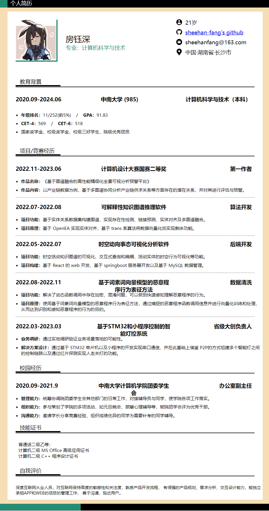


<!-- 可以点击这里查看网页版个人简历：[查看链接](../files/cv/cv.html)
图像预览版如下：
 -->
<html>

<head>
    <title>个人简历</title>
    <link href="https://sheehan-fang.github.io/files/cv/style.css" rel="stylesheet" type="text/css" />
</head>

<body>
    
个人简历

    

        

            
            

                房钰深
                
专业：计算机科学与技术

            

            

            <ul>
                <li class="dital">
                    
                    
21岁

                </li>
                <li class="dital">
                    
                    

                        <a href="https://github.com/Sheehan-Fang" target="_blank">sheehan-fang's github</a>
                    

                </li>
                <li class="dital">
                    
                    
sheehanfang@163.com

                </li>
                <li class="dital">
                    
                    
中国·湖南省·长沙市

                </li>
            </ul>
        

        

            
教育背景

        

        

            

                
2020.09-2024.06

                
中南大学 (985) 

                
计算机科学与技术（本科）

            

            <ul class="dital_list">
                <li style="margin-top: 10px;"><b>年级排名：</b>5/252(前2%)&nbsp&nbsp&nbsp&nbsp/&nbsp&nbsp&nbsp&nbsp<b>GPA：</b>92.17</li>
                <li style="margin-top: 10px;"><b>CET-4：</b>569&nbsp&nbsp&nbsp&nbsp/&nbsp&nbsp&nbsp&nbsp<b>CET-6：</b>518</li>
                <li style="margin-top: 10px;">国家奖学金、校级奖学金、校级三好学生、院级优秀团员</li>
            </ul>
        

        

            
项目/竞赛经历

        

        

            
2022.11-2023.06

            
计算机设计大赛国赛二等奖

            
第一作者

        

        <ul class="dital_list">
            <li style="margin-top: 10px;"><b>作品名称：</b>《基于图谱融合的高性能精细化全景可视分析预警平台》</li>
            <li style="margin-top: 10px;"><b>作品内容：</b>以产业链数据为例，基于多图谱协同分析产业链供求关系等方面存在的潜在关系，并对其进行评估与预警。</li>
        </ul>
        

        

            
2022.07-2022.08

            
可解释性知识图谱推理软件

            
算法开发

        

        <ul class="dital_list">
            <li style="margin-top: 10px;"><b>项目功能：</b>基于实体关系数据集构建图谱，实现存在性检测、链接预测、实体对齐及多图谱融合。</li>
            <li style="margin-top: 10px;"><b>项目原理：</b>基于 OpenEA 实现实体对齐，基于 trans 系算法将数据向量化后实现剩余功能。</li>
        </ul>
        

        

            
2022.05-2022.07

            
时空动向事态可视化分析软件

            
后端开发

        

        <ul class="dital_list">
            <li style="margin-top: 10px;"><b>项目功能：</b>时空活动知识图谱的可视化、交互式查询和编辑、活动实体的时空行为可视化等功能。</li>
            <li style="margin-top: 10px;"><b>项目构建：</b>基于 React 的 web 开发、基于 springboot 服务器开发以及基于 MySQL 数据管理。</li>
        </ul>
        

        

            
2022.08-2022.11

            
基于词素词向量模型的恶意程序行为表征方法

            
数据清洗

        

        <ul class="dital_list">
            <li style="margin-top: 10px;"><b>项目功能：</b>解决了动态函数调用中存在加密、混淆问题，可以做到快速感知理解恶意程序的行为。</li>
            <li style="margin-top: 10px;"><b>项目原理：</b>使用基于词素词向量模型的恶意程序行为表征方法，通过捕捉的恶意程序函数调用信息并进行向量化训练和处理，从而达到识别和感知恶意程序的行为的目的。</li>
        </ul>
        

        

            
2022.03-2023.03

            
基于STM32和小程序控制的智能灯控系统

            
省级大创负责人

        

        <ul class="dital_list">
            <li style="margin-top: 10px;"><b>业务调研：</b>通过实地调研验证业务场景落地的可能性。</li>
            <li style="margin-top: 10px;"><b>解决方案设计：</b>通过基于 STM32 单片机以及小程序的开发实现串口通信，并在此基础上借鉴 P2P的方式组建多个智能灯之间的控制链路以及通过红外探测实现人走关灯的功能。</li>
        </ul>
        

            
校园经历

        

        

            
2020.09-2021.9

            
中南大学计算机学院团委学生会

            
 办公室副主任

        

        <ul class="dital_list">
            <li style="margin-top: 10px;"><b>管理能力：</b>统筹协调院团委学生会其他部门的日常工作，对接辅导员与同学，使学院各项工作落实。</li>
            <li style="margin-top: 10px;"><b>组织能力：</b>参与策划了学院的多项活动，如元旦晚会、朋辈心理辅导等，被院团学会评为优秀干部。</li>
            <li style="margin-top: 10px;"><b>沟通能力：</b>邀请学长分享竞赛经验、组织成绩优异的同学为需要补考的同学辅导。</li>
        </ul>
        

            
技能证书

        

        <ul class="dital_list2">
            <li>普通话二级乙等；</li>
            <li>计算机二级 MS Office 高级应用证书</li>
            <li>计算机二级 C++ 程序设计证书</li>
        </ul>
        

            
自我评价

        

        

            深度互联网从业人员，对互联网保持高度的敏感性和关注度，熟悉产品开发流程，
            有很强的产品规划、需求分析、交互设计能力，能独立承担APP和WEB的项目的管理工作，
            善于沟通，贴近用户。
        

    

    

    <button onclick="topFunction()" class="btn" id="toTop" title="Go to top" style="display: none; bottom: 190px; right: 20px;">  
        

             
            返回顶部
        

    </button>
    <button onclick="backFunction()" class="btn" id="back" title="Go to top" style="bottom: 120px; right: 20px;">  
        <a id="top">
             
            返回主页
        

    </button>
    <button onclick="printdiv()" class="btn" id="printPage" title="Go to top" style="bottom: 50px; right: 20px;">  
        

             
            打印页面
        

    </button>
</body>

</html>